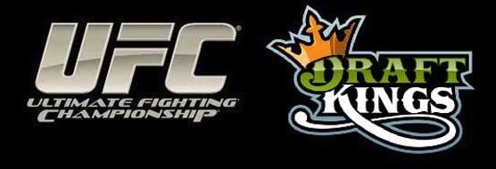
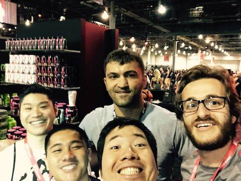

## Welcome

Welcome to my personal project in which I build a model to help choose UFC lineups for gambling on Draftkings (DK). This readme will not be a full tutorial like the one I have for the [fantasy golf](https://github.com/cschoeny/personal-projects/tree/ufc/Fantasy-Golf-Forecasting); rather, I will simply describe the methodology. See that readme for a primer on daily fantasy sports and the types of DK contests. In this project, our goal is to construct a lineup to win a large GPP. While the odds of winning a large GPP are _very_ low, following this methodology should transform these odds from simply playing a random lottery to making some well informed wagers.



## Methodology

Recall that in my Fantasy Golf project I built a probabilistic model, based on a Poisson Process, for how each golfer would score on a particular hole. I then used a Monte Carlo simulation in conjunction with linear programming to choose an optimal lineup.

Here we take a related, but slightly different approach. The key insight in this project is to leverage Vegas odds for the probabilities of victory / method of victory, but to rely on our self-built database for probabilistic distributions of DK scoring (based on weight class and round + method of victory). We then simulate the entire UFC event tens of thousands of times, and ultimately choose the specific 6-fighter lineup (which meets the DK salary requirements) that has won the most simulated events.

Philosophically, imagine an infinite parallel universes in which the UFC event occurs, and that the winners / methods of victory have some probabilistic distribution that the Vegas odds capture. We want to find the most often optimal (or, to borrow from poker vernacular, the nuts) lineup. While the odds of winning a large GPP are _very_ low, following this methodology should transform these odds from simply playing a random lottery to making some well informed wagers.

The following list describes the overall approach.

1. **Before Event: Gather Data -- Create Model**
* Gather data from every UFC fight over the past few years. This includes larger aspects such as the date, fighters, weight class, method of victory, and round of victors. It also includes more granular aspects needed for DK scoring such as number of significant strikes, takedowns, etc.

* Use a KDE approach to develop a DK point distribution for a winning fighter dependent on his/her weight class, round of victory, method of victory.

2. **Specific Event: Get Vegas Odds -- Monte Carlo Simulation -- Get DK Salaries -- Linear Programming Optimization**

* First we get the Vegas odds for each fight, including not only the victor, but the method of victory per round.

* Using this data, we then construct the UFC event itself (we will cover this in the Class Structure section), and run a Monte Carlo simulation to get a distribution of points per fighter per event.

* Per event, use linear programming optimization to select the lineup (which meets salary conditions) that has the highest sum of DK points.

* Display the specific lineup that has one the most events.

3. **Post Event: Update the Database**

* After the event has concluded, we use the real life outcomes to update our database for better future predictions.

The R&D related to the kernel density estimation can be found in the /research directory. The output of the data scraping can be found in the /data directory. All the code used in this project can be found in the /lib directory, with main.py as the main driver.

## Class Structure
We have a single **Event** instance which contains multiple individual **Fight** instances. Each **Fight** instance contains two **Fighter** instances.

#### Fighter Class
The main purpose of the Fighter class is to be able to sample DK points for a specific fighter given specific victory conditions. A fighter instance represents a single fighter with the following inputs:
* Name
* DK Salary
* Weight Class
* Championship Fight (Boolean)

Within the class, we have functions to create the kernel density estimation for DK points for all possible methods of victory for each round. We also include a function to sample from this distribution.

#### Fight Class
A Fight instance contains two fighters as well as the full table of odds for each method of victory for each round per fighter.

Additionally, we pass in the number of fights to simulate. Inside the fight instance we then use the Vegas odds to randomly choose a winner, method, and round for each simulated fight. We also get the number of DK points assigned per fighter by calling on the respective fighter class.

#### Event Class
An event instance contains all the individual fight instances, normally around 12. For each individual event simulation, we run the LP optimization to get the optimal lineup (for that specific event realization).

## Sample Output
After simulating the upcoming UFC 249 event 10,000 times, the main result of this program is an ordered list of the lineups that had the highest DK points possible given salary constraints (for that specific event realization); the number after the salary shows the number of times that the lineup was optimal.
```python
[(('Anthony Pettis',
   'Greg Hardy',
   'Carla Esparza',
   'Tony Ferguson',
   'Ronaldo Souza',
   'Charles Rosa'),
  30),
 (('Donald Cerrone',
   'Greg Hardy',
   'Michelle Waterson',
   'Tony Ferguson',
   'Ronaldo Souza',
   'Bryce Mitchell'),
  24),
 (('Henry Cejudo',
   'Anthony Pettis',
   'Greg Hardy',
   'Carla Esparza',
   'Ronaldo Souza',
   'Charles Rosa'),
  18),
 (('Anthony Pettis',
   'Yorgan de Castro',
   'Carla Esparza',
   'Tony Ferguson',
   'Ronaldo Souza',
   'Bryce Mitchell'),
  15),...
```
___

### Note on Tools

This project is done entirely in _Python_. The _Beautiful Soup_ package was invaluable in scraping fight results and Vegas odds. I used _sklearn_ to perform the kernel density estimation. The _Pandas_ library was the main workhorse in this project as we used dataframes as our main data structure. I used _PuLP_ to run the linear programming optimization.

___

### Bonus

It's fun to be able to work on data science projects on subjects that I'm passionate about. The programming / statistics / gambling side of things is obvious, but martial arts has also been a constant in my life.

In my youth, I trained in Tae Kwon Do for a decade, earning a 2nd degree black belt. Muay Thai played an important role in both my undergrad and graduate studies at UCLA.

I've long been a fan of MMA and the UFC, having spent countless hours watching fights and posting on message boards. I've also been lucky enough to attend multiple MMA events live. The following is a picture of me and some friends with UFC Heavyweight Champion Andrei Arlovski.


